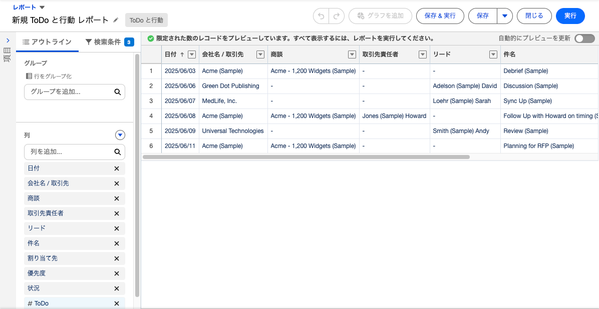
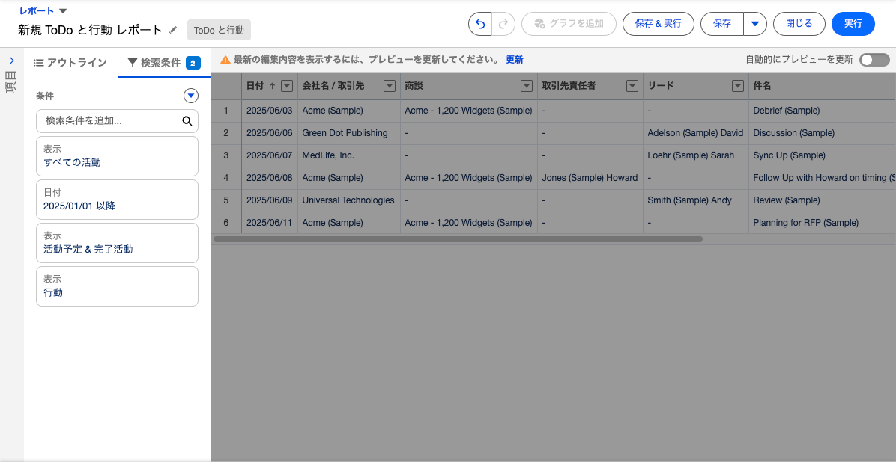
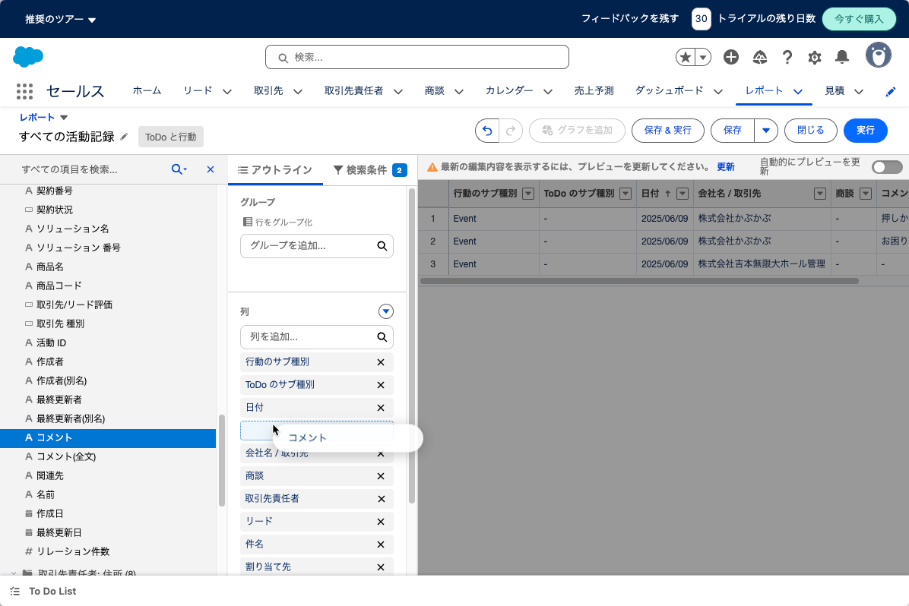
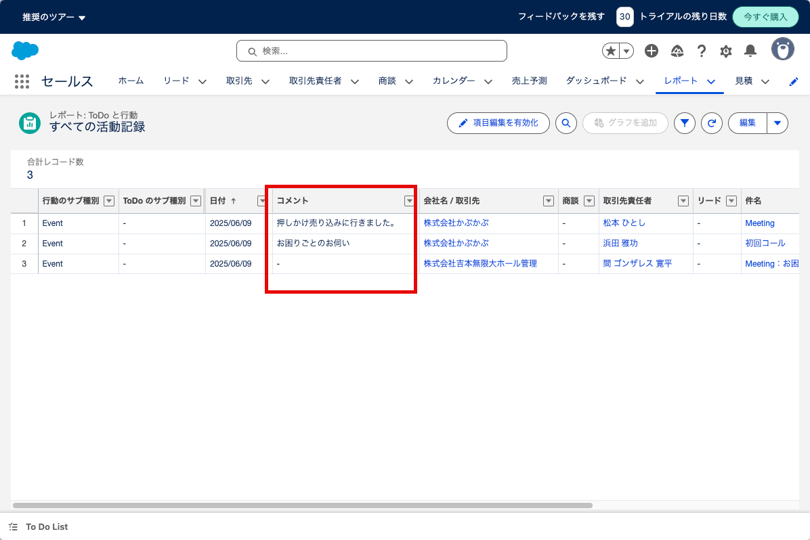

# レポート機能

SalesForceは柔軟なレポート機能を持っています。(多分、Lightning Platformの機
能)

専門家でなくNon Techなユーザーが自分で自由にレポートを作ることもできますし、
組織で標準のレポートを作成することもできます。

例えば、「活動記録」の一覧を作成するようなレポートを新規に作成してみます。

新規レポートから「Todoと行動」のデータをソースとしてレポートを作成したもので
す。デフォルトの検索条件が設定されているため、検索条件を変更して自分の担当分
が選択されるように変更します。

既存設定条件を、すべての行動で今年分だけ、予定も完了分も表示するように変更し
ました。

訪問のタイトルしか表示されないため、詳細も表示できるよう項目から「コメント」
を追加します。これもドラッグ＆ドロップで追加できます。

