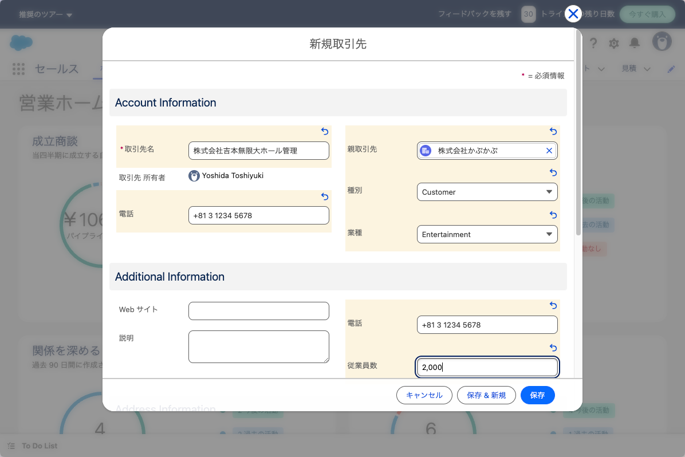

# 取引先登録

営業担当員として取引先の登録を行います。トップ画面に表示されているタブより
「取引先 - 新規取引先」を選択します。

- 連絡先、従業員数、企業のWebサイト、住所、業種などが設定できます。
- 種別には"Customer"をセットしますが、パートナーやこれからの見込客、スポンサ
ーなども登録可能
- 住所は請求先と納入先はデフォルトで登録可能。
- 親会社を設定できるので、企業間のヒエラルキーや会社 - 事業所などの関係を管
理できる可能性あり。

