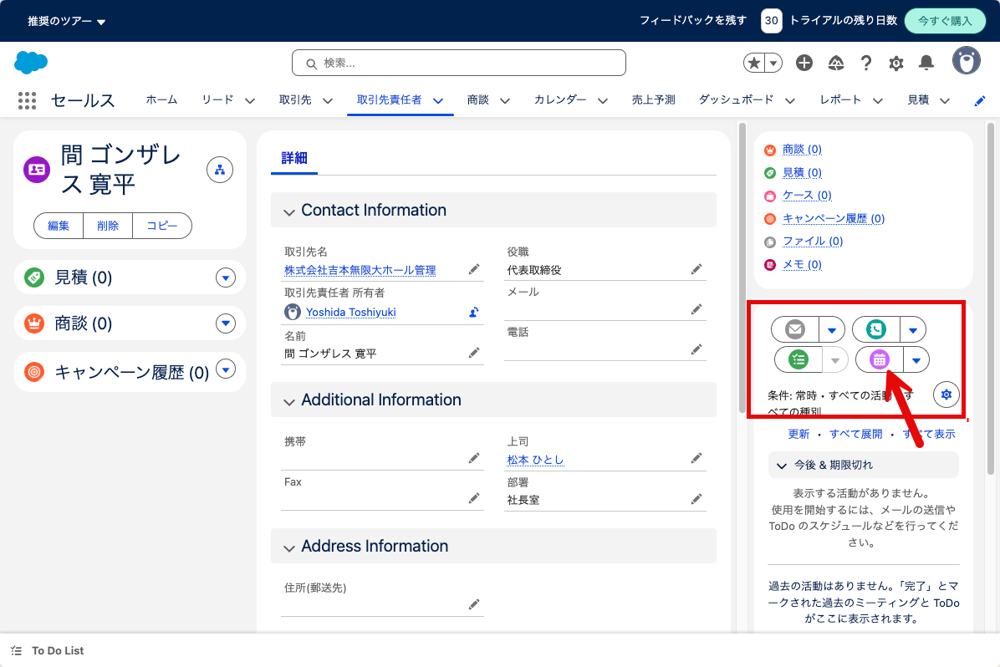
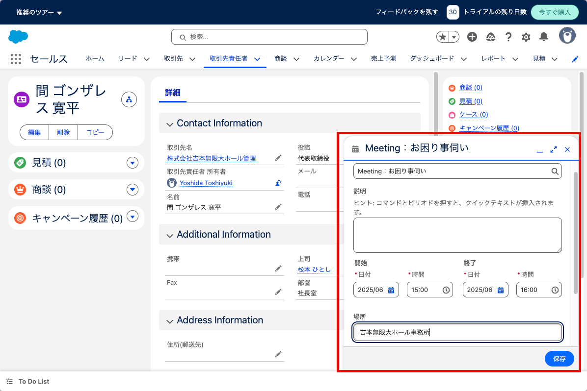
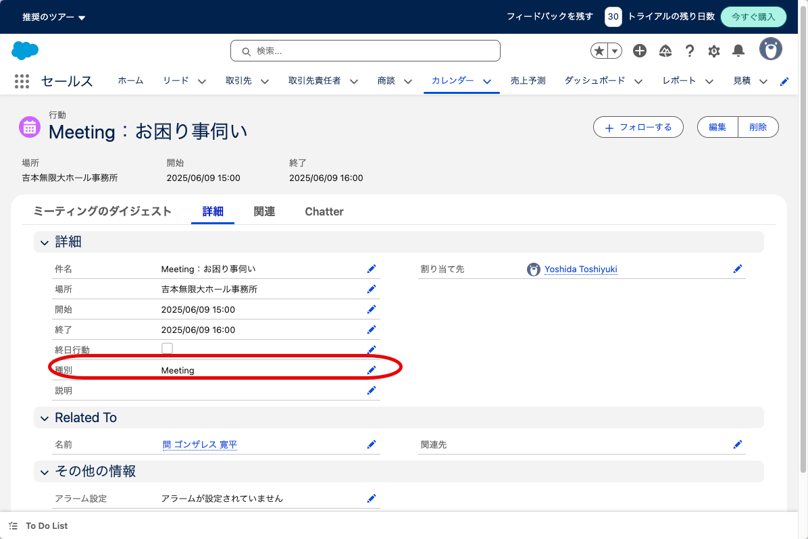
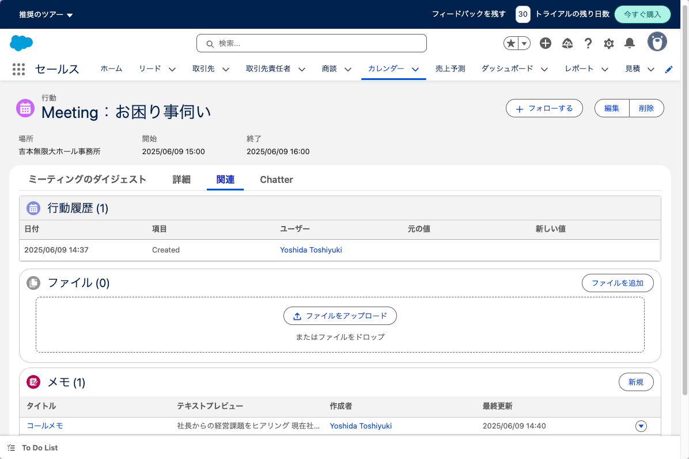
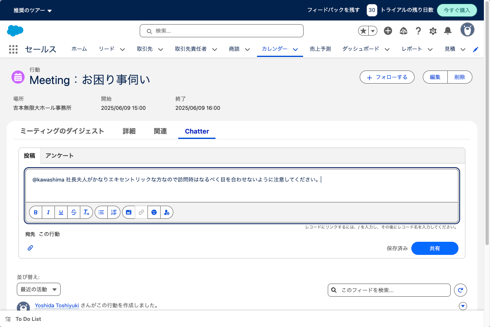

# 訪問記録

訪問記録やメール、電話、オンライン会議などは「活動記録」として記録できます。

「取引先」からも登録可能ですが、訪問先が明確な場合が多いと思いますのでここで
は「連絡先」から登録するものとします。

取引先に赤枠部分に活動記録を登録するためのリンク集があります。
今回は訪問する想定で「新規行動」を選択します。

件名や日時、場所などが取引先、連絡先と関連付けて保存されます。

登録後に編集で種別などを変更できます。

訪問記録の「関連」で訪問時に使用した資料は受領した資料を登録したり、訪問メモ
を残すことができます。

また訪問後にセンター内で他の担当者に共有すべきことがある場合は、
Chatter機能を使って他の担当者に訪問記録と関連付けてメッセージを送ることも可
能です。

アンケート機能もあるようですが、検証環境では内部向けなのか取引先向けなのか不
明でした。

