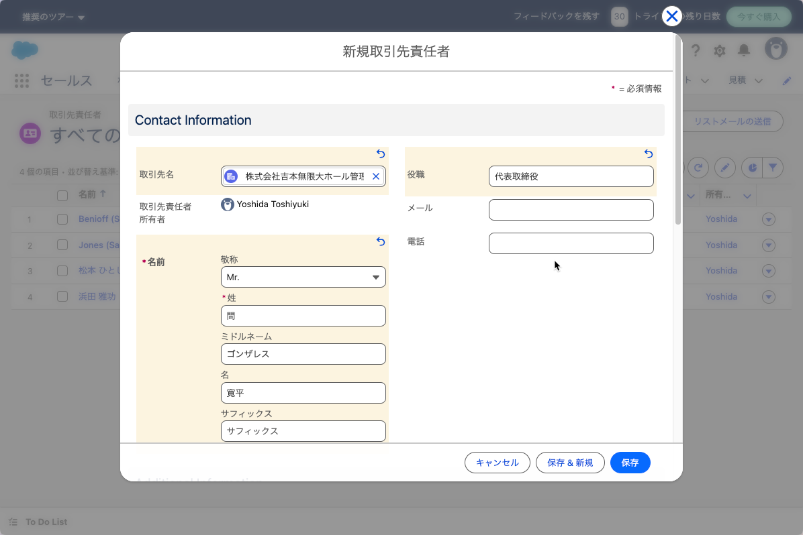

# 連絡先

取引先ができてたら、取引先の連絡先を登録します。

```admonish info
SalesForceに合わせて以下では、「取引先責任者」という言葉を使っていますが、
一般に連絡先、コンタクトリストと呼ばれるものです。
```

取引先の表示から「取引先責任者」、またはタブから「取引先責任者」を選択します
。以下ではタブから「取引先責任者」を選択したものとします。


この画面ではフィルター機能を使って、リスト表示する対象を絞ることができます。

「新規」を選択して、取引先責任者を登録します。



登録した取引先（アカウント）と関連付けて取引先の連絡先を登録できます。
複数の担当者と連絡をとる必要がある場合は、必要な人数を登録することが可能です
。
