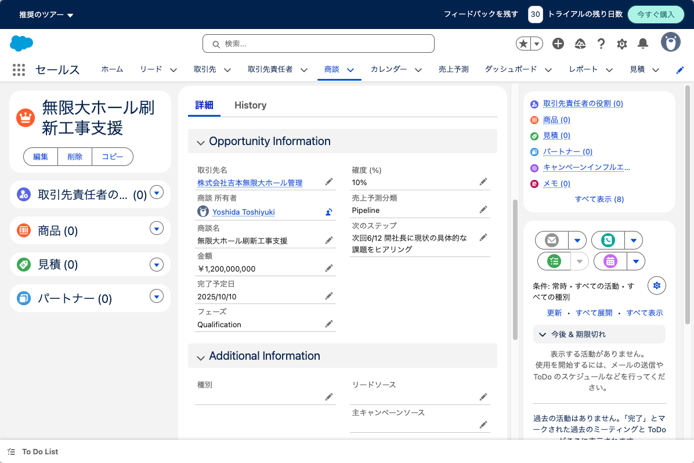
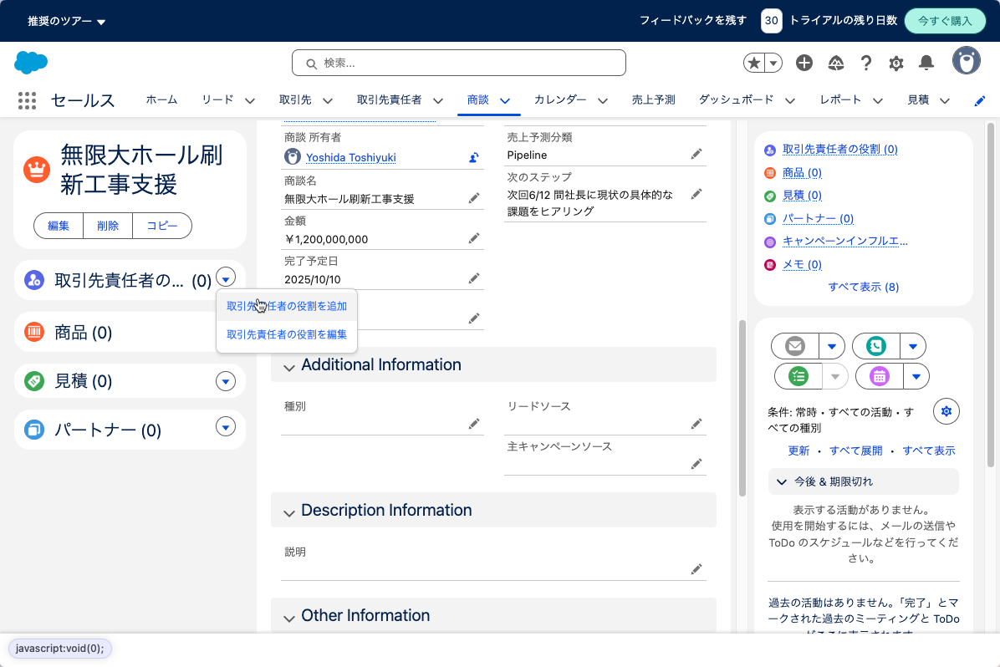
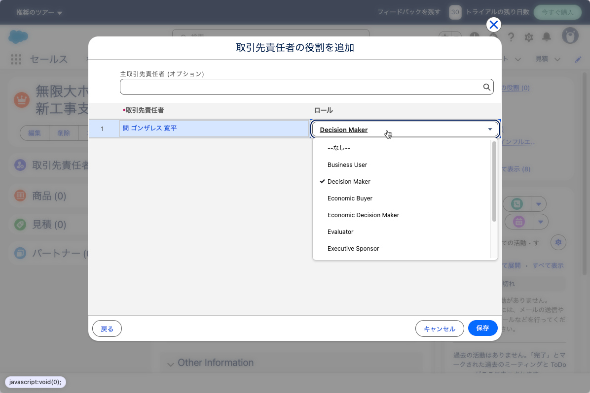
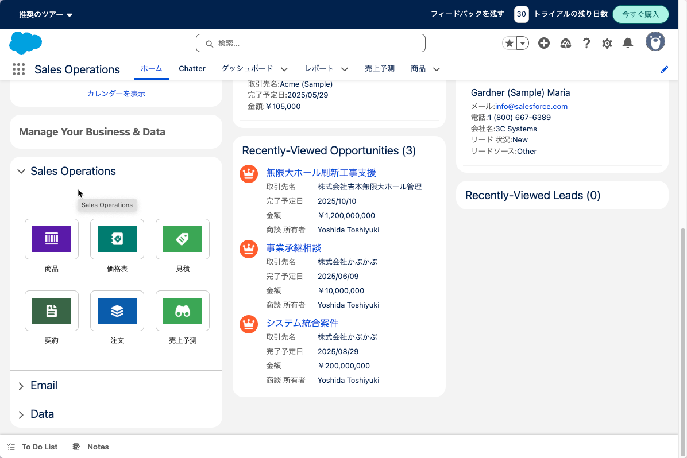
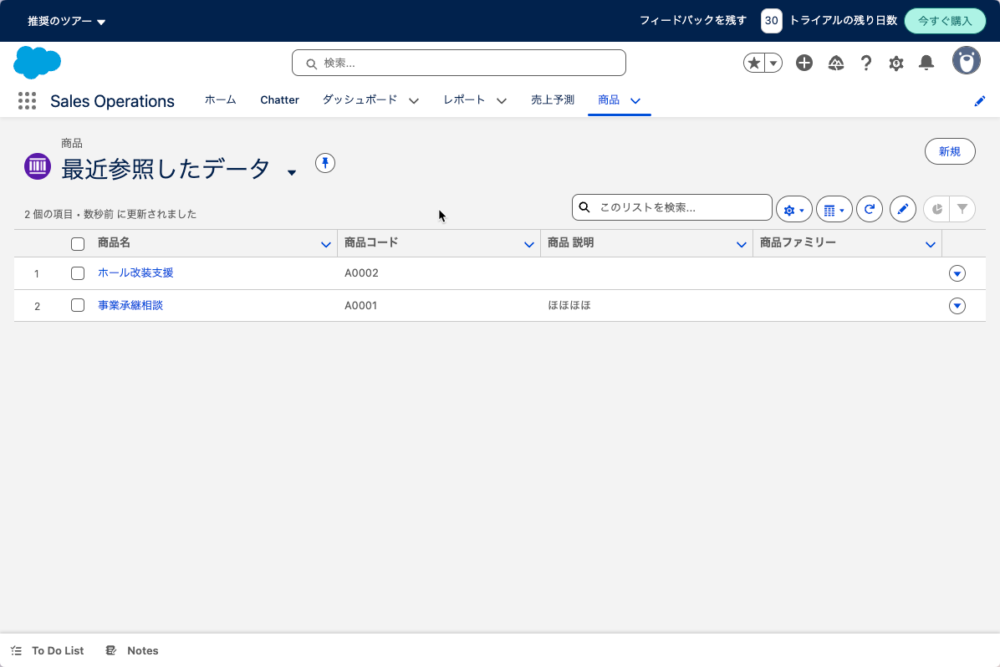
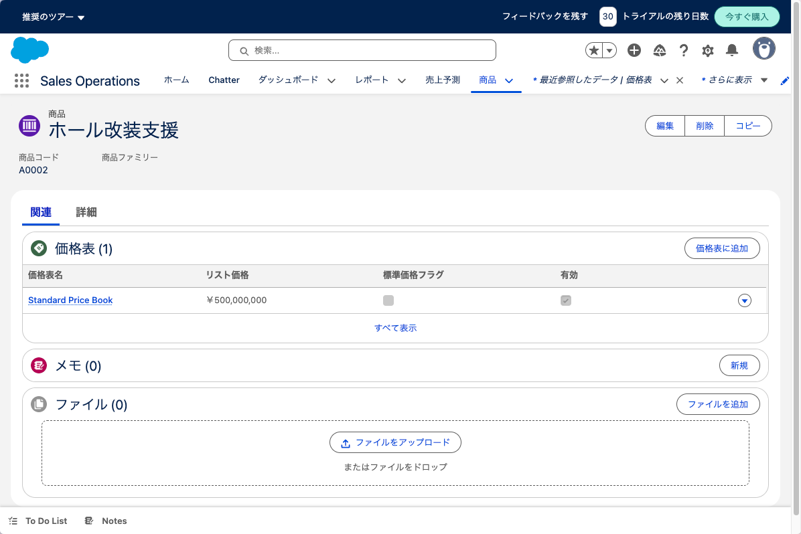
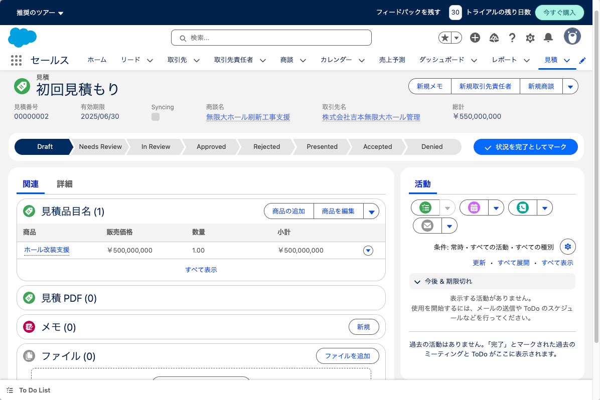

# 商談

「商談」とは具体的な契約に向けた契約候補です。
"Opportunity"や「案件」という言葉のほうが一般的だと思います。

センターの場合は、散発的な訪問や相談でなく支援（契約）までに
ある一定期間企業と交渉を行いその進捗管理が必要な場合に使う
機能であると想定しています。

タブから「商談 - 新規商談 」を選択します。

新規に商談を登録した画面です。
取引先は既存の登録から選択し、商談名、見込金額、フェーズなどを設定します。

フェーズはデフォルトでは次のものが設定されています。

| フェーズ名 | 一般的な日本語  | 成約確度 |
| - | - | - |
| Qualification | 商談機会の選別 | 10% |
| Needs Analysis | ニーズ分析・要件把握 | 35% |
| Proposal | 提案・見積提示 | 75% |
| Negotiation | 条件調整 | 90% |
| Closed Won | 受注・成約 | 100% |
| Closed Lost | 失注・不成約 | 0 % |

また、フェーズに合わせて売上予測分類がアサインされます。

これにより、営業は自身の売上達成実績、期末売上達成予測、
パイプライン積み上げ（売り込みを行う種となる案件）の金額を
簡単に集計できます。

このような一律の基準で実績や予測が表示できるため、
全社を見渡したダッシュボードが可能となりエグゼクティブが
現在の自社の状況をすぐに把握できます。（把握するという責任と業務定義がないと
意味がありませんが)

商談を進める内に意思決定者が分かってきたので、登録します。

登録の際にはどのような役割の人なのかも登録します。
例えば、「意思決定者」「エグゼクティブスポンサー」などです。

ある程度商談が進み、具体的企業が求めるものが分かってきたら
候補となる商品を登録します。右側のペインから「商品」を選択します。

その前に、検証環境では商品が登録されていないので、商品登録を行います。
セールスは商品登録の権限がないので、セールスオペレーターメニューに入ります。

商品登録を行います。

商品は価格表と別のデータとして管理されています。これは同一商品でも
顧客によって価格設定を変更可能とするためです。

商品と価格表を関連付けて、価格を登録します。

またセールスに戻って、先ほどの「商談」に商品を結びつけます。

商品を関連付けたら、「見積」を作成します。
見積を企業に提示するということは正式にプロポーザルを企業として提示すると言う
ことなので、内部での価格承認などのプロセスをサポートできるようになっています
。

承認も終わり、先方が受け入れる、または拒否するまでセールスの機能でサポートで
きる範囲だと思われます。

